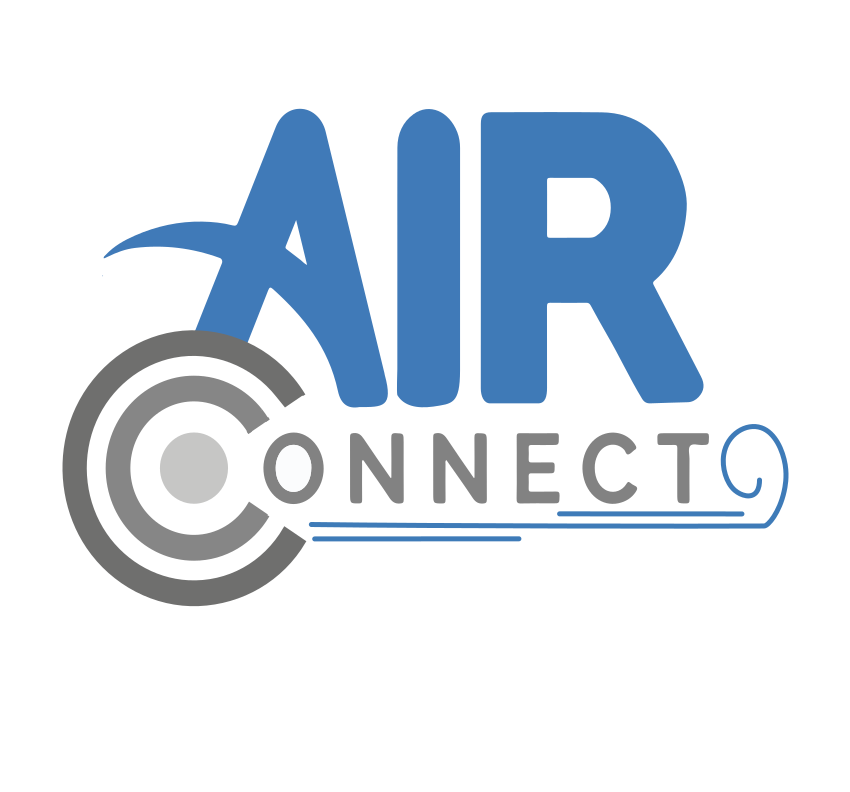
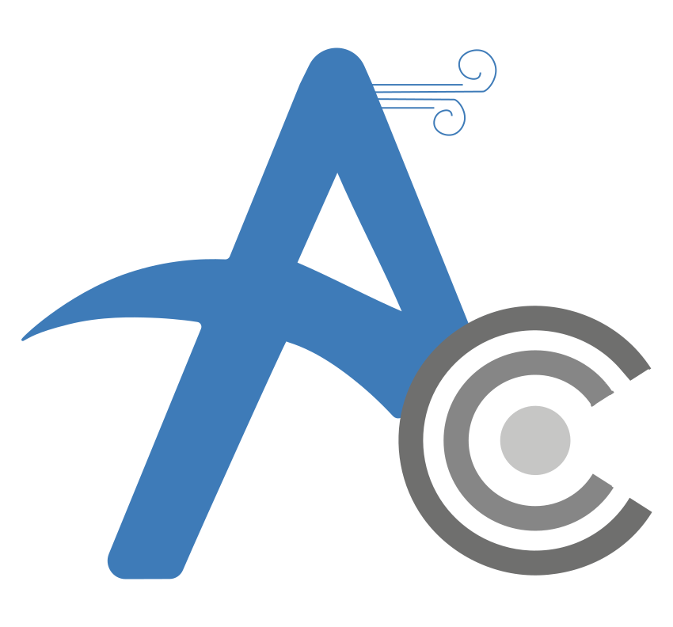

  

## 🌬️ Acerca de AirConnect

**AirConnect** es un ecosistema IoT diseñado específicamente para el sector **HORECA** (Hoteles, Restaurantes y Cafeterías). El sistema combina hardware de monitoreo en tiempo real con una potente API en Laravel para garantizar ambientes saludables y seguros para los clientes.

### Funcionalidades Clave
- **Ingesta de datos IoT:** Endpoints especializados para la recepción de métricas de sensores MQ.
- **Monitoreo Local Activo:** Lógica en hardware que activa alertas (Buzzer/LED) de forma instantánea.
- **Gestión de Dispositivos:** Administración centralizada de nodos sensores distribuidos en el establecimiento.
- **Análisis Histórico:** Almacenamiento y consulta de datos para reportes de calidad del aire.
- **Seguridad:** Autenticación robusta de usuarios mediante Laravel Breeze.

## 🛠️ Prototipo de Hardware (IoT)

El código del prototipo es el encargado de la interacción física con el entorno. Se basa en un microcontrolador Arduino que gestiona:

1. **Captura:** Lectura constante de gases y partículas mediante sensores de la serie MQ.
2. **Respuesta Local:** Sistema de alerta sonora (Buzzer) y visual (LEDs) basada en umbrales de seguridad predefinidos.
3. **Conectividad:** Envío de paquetes de datos JSON hacia nuestra API RESTful para su procesamiento y almacenamiento.

## 🚀 Instalación y Configuración

Para poner en marcha el entorno de desarrollo:

1. **Clonar el repositorio:** `git clone https://github.com/Santiago4lvz/AirConnect-Backend.git`
2. **Instalar dependencias:** `composer install` y `npm install`
3. **Configurar entorno:** Copia el archivo `.env.example` a `.env` y configura tu base de datos.
4. **Generar App Key:** `php artisan key:generate`
5. **Migraciones:** `php artisan migrate`
6. **Servidor:** `php artisan serve`

## 👥 Equipo de Desarrollo (Air Connect Team)

Este proyecto es el resultado de la colaboración de los integrantes del equipo:

* **Lider de proyecto**
* Ingrid Ayala Salaya

* **Lider de equipo**
* Mario Alfonso Santiago Alvarez

* **Desarrolladores**
* Carlos Misael Tah Moo
* Said Humberto Jiménez Garcia
* Sebastián May Gamas
* Jorge de Jesus Morales Ramirez

---

  
   
  Proyecto desarrollado para la <b>Universidad Tecnológica de la Riviera Maya</b>.

